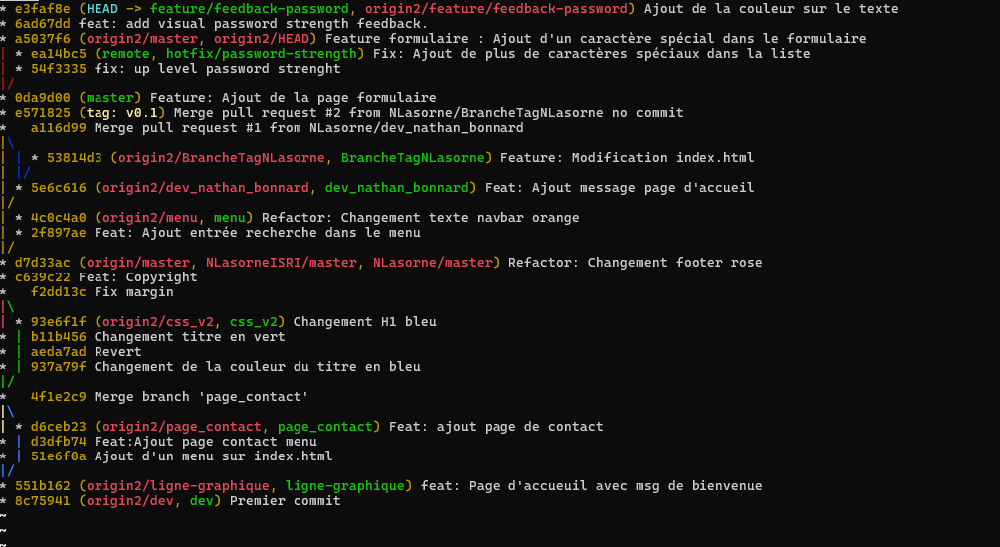

Auteur : Nathan Lasorne 
Important : Étant tout seul lors de ce TD, j'ai simuler les échanges entre étudiant A et B dans les échanges des pull requests

   git log --graph --oneline --all : 
   
  

    Q1. Quelle est la différence entre git push --force et git push --force-with-lease ? Pourquoi la seconde est-elle indispensable en équipe ?
  Push --force pousse la branche locale peut importe la condition, alors que push --force-with-lease empêche de pousser une branche locale si la branche distante n'a pas le même ancêtre.
  C'est nécessaire pour le travaille en équipe car certains membre de notre équipe peuvent faire des modifications sur la même branche que la notre, push force va écraser leur travail et peut créer des conflits entre les repos local et le repo distant. 
    
    Q2. Pourquoi privilégie-t-on l'usage de git rebase par rapport à git merge pour maintenir une branche de fonctionnalité à jour ?
 Rebase permet de modifier l'historique des commits, permettant de rassembler plusieurs petit commit en un seul ou de changer les messages de certains commits , facilitant la lecture de l'historique du repo distant. Le merge va juste mettre l'ensemble des commits de la branche locale sur le repo distant sans possibilité de changement.
    
    Q3. Quel est l'intérêt d'imposer un Squash de commits avant la fusion d'une Pull Request dans un pipeline CI/CD ?
  Le squash va permettre la fusion de plusieurs petits commits en un seul, facilitant la relecture par les pairs (ou les automates dans le cas CI/CD) et ainsi augmenter la vitesse de validation des pull requests.
    

